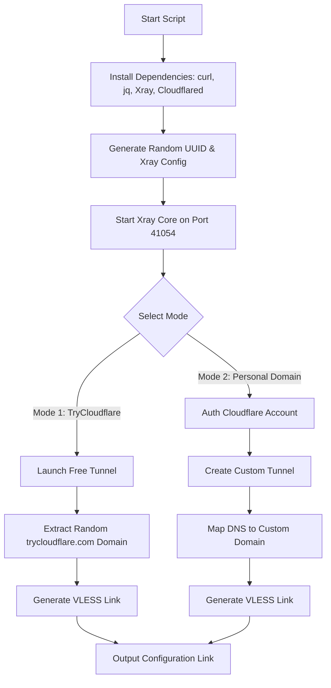

# 🌐 ZedTunnel Pro | Network Tunnel Auto-Deployer

[](LICENSE)
[](https://github.com/XTLS/Xray-core)
[](https://cloudflare.com)
[](#)
[](#)

An automated script to set up a secure VLESS-over-WebSocket tunnel using Xray and Cloudflare Tunnels (supporting both free TryCloudflare and personal custom domains). It routes traffic through clean Cloudflare CDN IPs to bypass network censorship.

یک اسکریپت خودکار برای راه‌اندازی تونل امن VLESS-over-WebSocket با استفاده از Xray و تونل‌های کلودفلر (پشتیبانی از TryCloudflare رایگان و دامنه شخصی). این اسکریپت ترافیک را از آی‌پی‌های تمیز کلودفلر عبور می‌دهد تا محدودیت‌های اینترنت را دور بزند.

---

## ⚡ Features | ویژگی‌های برجسته

* **🚀 Fully Automated:** Installs and configures all dependencies (`Xray`, `Cloudflared`, `curl`, `jq`) with a single command.
* **🔒 VLESS + WebSocket:** Configured with modern secure VLESS protocol with WS transport.
* **☁️ Dual Tunneling Modes:**
  * **TryCloudflare (Free):** Instant deployment with no Cloudflare account or domain required.
  * **Personal Tunnel (Custom Domain):** Link your own domain/subdomain with automated Cloudflare DNS routing.
* **🛡️ Smart UI & Resilient Logic:** Includes interactive UI prompts, Persian digit conversion, smooth CLI progress animations, and automatic cleanup of previous instances.
* **🌐 Clean IP Routing:** Generates a ready-to-use VLESS link pre-configured with Cloudflare's clean IP.

---

## 📋 Prerequisites | پیش‌نیازها

* A Linux Virtual Private Server (VPS) running **Debian** or **Ubuntu**.
* `root` privileges.
* An active internet connection on the VPS.

---

## 🚂 One-Click Deploy to Railway | استقرار آسان روی ریل‌وی

You can deploy ZedTunnel Pro directly to **Railway** for free with a single click. The script runs automatically in the background on startup.

می‌توانید با استفاده از دکمه زیر پروژه را مستقیماً روی **Railway** به صورت رایگان مستقر کنید. اسکریپت به صورت خودکار در پس‌زمینه اجرا می‌شود.

[](https://railway.com/new/template?template=https://github.com/iWZed/zed-tunnel-pro)

### ⚙️ Environment Variables | متغیرهای محیطی
Before deploying, you can configure these variables in the Railway dashboard:

قبل از دیپلوی، می‌توانید این متغیرها را در پنل ریل‌وی تنظیم کنید:
* `USERNAME`: Web terminal login username (Default: `admin`)
* `PASSWORD`: Web terminal login password (Default: `zed123`)

### 🔑 How to Get Your Link | نحوه دریافت لینک اتصال
1. Once deployment is complete, open the **Public Domain URL** provided by Railway.
2. Log in using your configured `USERNAME` and `PASSWORD`.
3. Your VLESS connection link will be printed on the screen automatically! (You can also find it in the deployment logs).

۱. پس از اتمام دیپلوی، وارد لینک دامنه عمومی (Public URL) که ریل‌وی به شما داده بشوید.
۲. با یوزرنیم و پسورد مشخص‌شده لاگین کنید.
۳. لینک اتصال VLESS شما به صورت خودکار روی صفحه چاپ خواهد شد! (همچنین می‌توانید آن را در بخش لاگ‌های ریل‌وی مشاهده کنید).

---

## 🚀 Usage on VPS | نحوه استفاده و اجرا روی سرور مجازی

### Method 1: Direct execution (One-Liner) | روش اول: اجرای مستقیم خط فرمان
```bash
bash -c "$(curl -fsSL https://raw.githubusercontent.com/iWZed/zed-tunnel-pro/main/zed.sh)"
```

### Method 2: Git Clone (Alternative / Fallback) | روش دوم: کلون پروژه (روش جایگزین در صورت اختلال در دانلود مستقیم)
```bash
git clone https://github.com/iWZed/zed-tunnel-pro.git && cd zed-tunnel-pro && bash zed.sh
```

---

## 🛠️ How it Works | نحوه کارکرد



---

## ⚙️ Tunnel Options Explained | توضیح حالت‌های تونل

### 1️⃣ TryCloudflare Tunnel (Free)
* Best for quick tests and temporary connections.
* Does not require a Cloudflare account or registration.
* A random temporary subdomain (e.g., `xxx.trycloudflare.com`) is generated dynamically.

### 2️⃣ Personal Tunnel (Custom Domain)
* Best for persistent, stable, and production-grade connections.
* Requires a Cloudflare account and a domain pointed to Cloudflare.
* You will be prompted to authenticate by clicking a link provided by Cloudflare.
* Enter your custom subdomain (e.g., `vip.yourdomain.com`) to route the tunnel.

---

## 🔍 Connection Customization | شخصی‌سازی آی‌پی تمیز

The generated VLESS configuration link uses `188.114.96.6` as the connection address. You can replace this IP in your client app (e.g., v2rayN, Shadowrocket, Streisand, v2rayNG, Nekobox) with any other **clean Cloudflare IP** scanned from your local network provider for optimal performance.

لینک VLESS تولیدشده به صورت پیش‌فرض از آی‌پی `188.114.96.6` استفاده می‌کند. شما می‌توانید این آی‌پی را در نرم‌افزارهای کلاینت خود (مانند v2rayNG یا Nekobox) با هر **آی‌پی تمیز کلودفلر** دیگری که از شبکه خود اسکن کرده‌اید جایگزین کنید تا بهترین سرعت و پایداری را دریافت نمایید.

---

## 📝 License | لایسنس

Distributed under the MIT License. See `LICENSE` for more information.

این پروژه تحت لایسنس MIT منتشر شده است.
